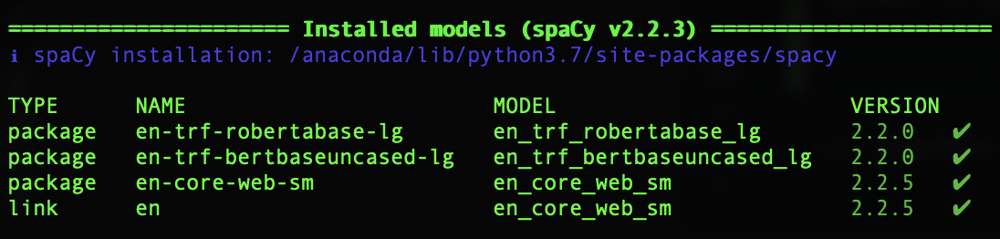

# CLEVR Graph Parser Library 
**CLEVR-Parser** is a graph parser for the CLEVR dataset. Code currrently under review stage - soon to be released. 

## Table of Contents
   * [Introduction](#introduction)
   * [Getting Started](#getting-started)
   * [Getting Help](#getting-help)
   * [Demo](#demo)
   * [Installation](#installation)
       * [Install ClevrParser using PyPI](#install-clevr-parser-using-pypi)
       * [Install ClevrParser in Anaconda Python](#install-clevr-parser-in-anaconda-python)
       * [Install ClevrParser from Github source](#install-clevr-parser-from-github-source)
   * [Citing](#citing)
   * [References](#references)

## Introduction

## Getting Started

## Getting Help

If you get stuck or have a problem, there's many ways to make progress and get help or support:

- [Read the documentation](https://clevr-parser.readthedocs.io)
- [Consult the examples][demos]
- Contact us:
  - [Ask questions and discuss problems on the ClevrParser Discourse forum](https://community.clevr-parser.io)
  - [File an issue](https://github.com/raeidsaqur/clevr-parser/issues/new/choose)
  - Send us an email at [asd|rsaqur@cs.princeton.edu](mailto:rsaqur@cs.princeton.edu?subject=Question%20about%20the%20Clevr-Parser%20library)


## Demo  

Run the download.sh script form the root directory.
clevr_parser
	|-data/raw

## Installation
ClevrParser is a Python 3 library and we recommend using Python version `3.7`. The required Python version
can be downloaded and installed from [python.org](https://python.org/). Alternatively, use the Anaconda Python
environment, available from [anaconda.com](https://www.anaconda.com/download/).

The ClevrParser library can be installed from PyPI, from Anaconda Cloud, or directly from GitHub, as described below.

#### Install ClevrParser using PyPI:
To install ClevrParser library from [PyPI](https://pypi.org) using `pip`, execute the following command:
```
$ pip install clevr-parser
```

[Some of the examples][demos] require installing additional dependencies as well as `clevr-parser`. To install these dependencies as well as ClevrParser using `pip` execute the following command:
```
$ pip install -r requirements.txt 
```

#### Install ClevrParser in Anaconda Python:
The ClevrParser library is available an [Anaconda Cloud](https://anaconda.org/raeidsaqur/clevr-parser) and can be installed in [Anaconda Python](https://anaconda.com) using the command line `conda` tool, execute the following command:
```
$ conda install -c raeidsaqur clevr-parser
```


#### Install ClevrParser from Github source:
First, clone the ClevrParser repository using `git`:
```
$ git clone https://github.com/raeidsaqur/clevr-parser.git
```

Then, `cd` to the ClevrParser folder, and install the library by executing the following commands:
```
$ cd clevr-parser
$ pip install .
```

### Prerequisites 
Select the backend to use:

-*- Spacy -*-

The default backend uses `spacy` for language parsing and pretrained LM models used for embeddings.

Please see spacy's doc for installation [instructions](https://spacy.io/usage).

Spacy language models (LM) can be downloaded following instructions [here](https://spacy.io/usage/models).
N.b. the `spacy-transformers` package ([homepage](https://spacy.io/universe/project/spacy-transformers), [github](https://github.com/explosion/spacy-transformers)),
can be used to download SotA transformer based (BERT, XLNet, RoBerTa) LMs - including the popular HuggingFace implementations.

The very basic installation entails:
```angular2
$ pip install spacy
$ python -m spacy download en_core_web_sm 
```

Once installed, validate the available LMs using: 
`python -m spacy info` and `python -m spacy validate`.

 

-*- Stanford NLP -*-

Any other standard NLP parsers can be used as a backend. A concrete parser class should extend the `ParserBackend` class,
satisfying the `Parser` interface signature (e.g. `parse(..)`).


## Citing
If you use any part of this library in your research, please cite it using the following BibTex entry
```latex
@article{saqur2020clevr,
  title={CLEVR Parser: A Graph Parser Library for Geometric Learning on Language Grounded Image Scenes},
  author={Saqur, Raeid and Deshpande, Ameet},
  journal={arXiv preprint arXiv:2009.09154},
  year={2020}
}
```


